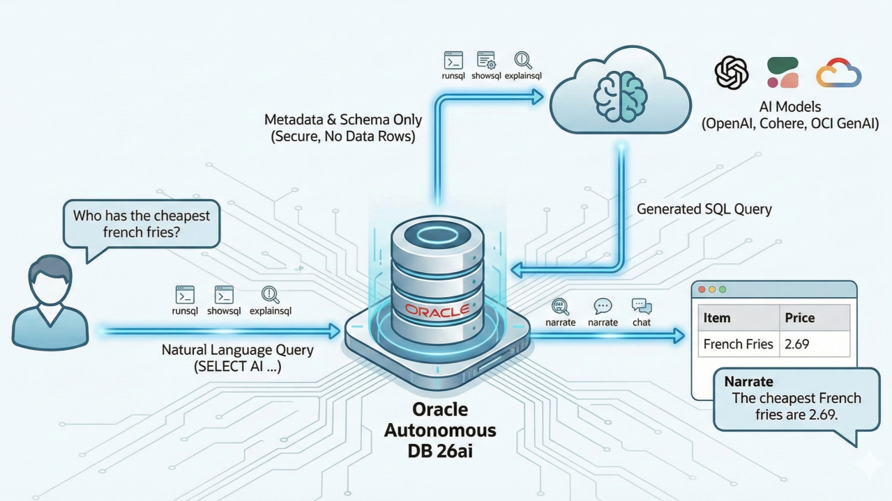

# llm-text2sql




Text-to-SQL REST service: Spring Boot 4 + Spring AI 2 + Oracle Database 26ai. LLM provider is switchable — local **Ollama** (default, no API key) or **Anthropic Claude**.

Natural-language question → grounded Oracle SQL (schema snapshot injected into the prompt) → validated (read-only guard) → executed with row cap and timeout → JSON result.

## Table of Contents

1. 🏗️ [Architecture](#architecture)
2. ⚙️ [Configuration](#configuration)
3. 🚀 [Run](#run)
4. 🌐 [API](#api)
5. 🤖 [Native Oracle Select AI passthrough](#native-oracle-select-ai-passthrough)
6. 🤝 [Insomnia](#insomnia)
7. 🔐 [Security notes](#security-notes)
8. 💡 [Deep Dive: Oracle Database 26ai — the AI-Native RDBMS](#deep-dive-oracle-database-26ai--the-ai-native-rdbms)

<a id="architecture"></a>
## 1. 🏗️ Architecture

```
POST /api/v1/query
   └─ TextToSqlService
        ├─ SchemaService          in-memory schema snapshot from ALL_TABLES / ALL_TAB_COLUMNS / constraints
        ├─ ChatClient             Ollama (local) or Anthropic — structured output → {answerable, sql, explanation}
        ├─ SqlGuard               SELECT/WITH only, single statement, forbidden-keyword scan
        └─ QueryExecutionService  read-only pool, maxRows cap, query timeout
```

Database schema is versioned with **Flyway** (`src/main/resources/db/migration`) — runs on app startup over its own writable connection; the query pool stays read-only. `V1__demo_schema.sql` / `V2__demo_data.sql` ship a demo shop schema; replace with your own migrations.

### How the LLM figures out joins the user never mentioned

The user's question doesn't need to name any table — the domain model comes entirely from the schema snapshot `SchemaService` injects into the prompt, not from the question text:

- `ALL_TABLES` / `ALL_TAB_COLUMNS` → every table, column, type, and comment
- `ALL_CONSTRAINTS` (type `P`) → primary keys
- `ALL_CONSTRAINTS` (type `R`) → foreign keys, rendered per table as `-- col references OTHER_TABLE(other_col)`

The full snapshot (every table in the schema, not just ones the question hints at) goes into the system prompt as-is. At generation time the LLM does two things itself, unassisted by code:

1. Maps nouns in the question to tables/columns by matching names and comments (semantic — the model's job).
2. Walks the `-- references` lines in the snapshot to find the join path between the tables it picked, using the declared FK column/direction.

So multi-table join capability rides entirely on schema-snapshot completeness — specifically, on FKs being declared as real constraints. A relationship that only exists at the application level (no DB-level FK) gives the model no signal, and it will likely get the join wrong or omit it.

<a id="configuration"></a>
## 2. ⚙️ Configuration

| Env var                       | Default                                        | Purpose                                                                                                                                                                                                  |
|-------------------------------|------------------------------------------------|----------------------------------------------------------------------------------------------------------------------------------------------------------------------------------------------------------|
| `LLM_PROVIDER`                | `ollama`                                       | `ollama` (local) or `anthropic`                                                                                                                                                                          |
| `OLLAMA_BASE_URL`             | `http://localhost:11434`                       | Ollama server                                                                                                                                                                                            |
| `OLLAMA_MODEL`                | `qwen2.5-coder:7b`                             | Local model (good SQL model at 7B)                                                                                                                                                                       |
| `ANTHROPIC_API_KEY`           | —                                              | Required only when `LLM_PROVIDER=anthropic`                                                                                                                                                              |
| `ORACLE_URL`                  | `jdbc:oracle:thin:@//localhost:1521/FREEPDB1`  | JDBC URL                                                                                                                                                                                                 |
| `ORACLE_USERNAME`             | `text2sql`                                     | DB user                                                                                                                                                                                                  |
| `ORACLE_PASSWORD`             | `text2sql`                                     | DB password — matches the `docker-compose.yaml` default; override both together                                                                                                                          |
| `TEXT2SQL_SCHEMA_OWNER`       | `ORACLE_USERNAME`                              | Schema to introspect and query                                                                                                                                                                           |
| `TEXT2SQL_SELECT_AI_PROFILE`  | `TEXT2SQL_DEMO`                                | Name of the `DBMS_CLOUD_AI` profile activated for `/api/v1/select-ai/query` — see [Native Oracle Select AI passthrough](#native-oracle-select-ai-passthrough) below                                      |
| `SELECT_AI_PROVIDER`          | `openai`                                       | Provider used by `/api/v1/select-ai/setup` (`openai`, `cohere`, `gemini`, `oci`)                                                                                                                         |
| `SELECT_AI_MODEL`             | `gpt-4.1-mini`                                 | Model name passed to `DBMS_CLOUD_AI.CREATE_PROFILE` by `/api/v1/select-ai/setup`                                                                                                                         |
| `SELECT_AI_PROVIDER_API_KEY`  | —                                              | Provider API key used by `/api/v1/select-ai/setup`; never accepted in the request body, only this env var                                                                                                |

Tunables under `app.text2sql` in `application.yaml`: `default-max-rows` (100), `hard-max-rows` (1000), `query-timeout-seconds` (30).

<a id="run"></a>
## 3. 🚀 Run

Docker Compose starts only Oracle Free 26ai. Ollama is expected to already be running on the host (e.g. as a system service — see below) with `OLLAMA_MODEL` already pulled; run the app itself locally:

```sh
docker compose up oracle   # starts oracle only, waits on healthcheck
mvn spring-boot:run         # app connects to localhost:1521 and to the host's localhost:11434
```

- Oracle `localhost:1521/FREEPDB1`, cached in a volume across restarts (`docker compose down -v` resets, including the database).
- Flyway creates and seeds the demo schema on first app start.
- First `docker compose up oracle` is slow: Oracle initializes its data files.
- To use Claude instead of the local model: `LLM_PROVIDER=anthropic ANTHROPIC_API_KEY=sk-ant-... mvn spring-boot:run`
- `docker-compose.yaml` also ships an `ollama` service (containerized, for environments with no host Ollama) — `docker compose up` (no service name) starts both, but the container will fail to bind `11434` if a host Ollama is already listening on it. Pick one: host Ollama (default assumption here) or `docker compose up ollama` (stop the host service first).
- NVIDIA GPU for the containerized Ollama: uncomment the `deploy` block on the `ollama` service in `docker-compose.yaml`.

<a id="api"></a>
## 4. 🌐 API

| Method | Path                      | Description                                                                                                                           |
|--------|---------------------------|---------------------------------------------------------------------------------------------------------------------------------------|
| POST   | `/api/v1/query`           | Generate SQL, execute, return rows (app-level Spring AI pipeline)                                                                     |
| POST   | `/api/v1/sql/generate`    | Generate SQL only (dry run)                                                                                                           |
| POST   | `/api/v1/select-ai/query` | Send the question straight to Oracle's native Select AI — the **database** generates and executes the SQL, this app just relays rows  |
| POST   | `/api/v1/select-ai/setup` | One-time (idempotent) bootstrap of the `DBMS_CLOUD_AI` credential + profile, using `SELECT_AI_PROVIDER_API_KEY`                       |
| GET    | `/api/v1/schema`          | Current schema snapshot                                                                                                               |
| POST   | `/api/v1/schema/refresh`  | Rebuild snapshot after migrations                                                                                                     |
| GET    | `/actuator/health`        | Health probe                                                                                                                          |

Example:

```sh
curl -s localhost:8080/api/v1/query \
  -H 'content-type: application/json' \
  -d '{"question": "Top 5 customers by total order amount", "maxRows": 50}'
```

Error mapping: `400` invalid request, `422` SQL rejected / question unanswerable / execution error, `502` model failure.

Same request shape against the native passthrough — the database, not this app, decides the SQL:

```sh
curl -s localhost:8080/api/v1/select-ai/query \
  -H 'content-type: application/json' \
  -d '{"question": "Top 5 customers by total order amount", "maxRows": 50}'
```

<a id="native-oracle-select-ai-passthrough"></a>
## 5. 🤖 Native Oracle Select AI passthrough

`POST /api/v1/select-ai/query` (`SelectAiService`) skips this app's own Spring AI pipeline entirely. It sends the question straight to Oracle's built-in **Select AI** feature (`DBMS_CLOUD_AI`): the *database* calls its own configured LLM provider, generates the SQL, executes it, and hands back rows — this app only activates the AI profile and relays the `ResultSet`. No `ChatClient`, no `SchemaService` snapshot, no `SqlGuard`. This is the concrete, running implementation of the comparison discussed in the [Deep Dive](#5-this-repos-approach-vs-select-ai--and-when-to-pick-each) below; the setup here follows the walkthrough in the [LinkedIn article](#reference) linked at the end of this file.

### ⚠️ The free/local Oracle image does NOT have Select AI — you need a real Oracle Cloud account

This is the single most common point of confusion when trying this endpoint locally, so it gets called out up front: **`container-registry.oracle.com/database/free` (both the regular and `-lite` tags) does not ship the `DBMS_CLOUD_AI` package at all.** Calling `/api/v1/select-ai/query` against the `docker-compose.yaml` Oracle container in this repo fails with:

```
ORA-06550: line 1, column 7:
PLS-00201: identifier 'DBMS_CLOUD_AI.SET_PROFILE' must be declared
```

That is not a bug in this app, and not something any `docker-compose.yaml` setting, `shm_size`, or seccomp flag can fix — `DBMS_CLOUD_AI` (Select AI) is a capability Oracle only ships on **Autonomous Database**, not on the free on-prem/container "Free" edition. The `/api/v1/query` and `/api/v1/sql/generate` endpoints (this app's own Spring AI pipeline) work fine against the local free container — only the native `/api/v1/select-ai/*` endpoints need a real Autonomous Database.

The good news: Oracle Cloud's **Always Free** tier includes an Autonomous Database instance with Select AI enabled, at no cost, no time limit, and no credit-card charge after signup. Steps, in detail:

1. **Create an Oracle Cloud (OCI) account** at [oracle.com/cloud/free](https://www.oracle.com/cloud/free/) — sign up with an email, verify it, and provide a payment card for identity verification only (Oracle explicitly does not charge it for Always Free resources unless you later upgrade). This creates a "root compartment" tenancy you'll provision resources into.

2. **Provision an Always Free Autonomous Database** from the OCI Console:
   - Console → hamburger menu → *Oracle Database* → *Autonomous Database*.
   - *Create Autonomous Database* → give it a display name and database name (e.g. `text2sqldemo`).
   - Workload type: **Transaction Processing** (or **JSON** — either supports Select AI; avoid *Data Warehouse* only if you specifically want OLTP-shaped defaults).
   - **Always Free** toggle: switch it on. This caps the instance at 1 OCPU / 20 GB storage — plenty for this repo's demo schema — and is what makes it free indefinitely.
   - Set the **ADMIN password** — this is the privileged account used for the one-time ACL/grant steps below, distinct from the `text2sql` runtime user this app connects as.
   - Choose **network access**: *Secure access from everywhere* is simplest to start; you can restrict to an IP allowlist later.
   - Click **Create Autonomous Database** and wait (usually 1–2 minutes) for it to reach the **Available** state.

3. **Get the connection details** — two options, either works with this app's `ORACLE_URL`:
   - **Wallet-based (mTLS)**: Database details page → *Database Connection* → *Download Wallet* (set a wallet password) → unzip it somewhere on the machine running this app → set `ORACLE_URL` to a TNS alias plus the wallet path, e.g. `jdbc:oracle:thin:@text2sqldemo_high?TNS_ADMIN=/path/to/unzipped/wallet`.
   - **TLS without a wallet (simpler, no file to manage)**: Database details page → *Database Connection* → *TLS authentication* tab → copy the **connection string** for the `_high` (or `_medium`) service — it's a `tcps://` Easy Connect string Oracle's `ojdbc17` driver (already a dependency here) understands natively as `ORACLE_URL` with no extra config.

4. **Create the `text2sql` runtime user** on this new instance (same statements used earlier in this README for the local DB, run once via Database Actions → SQL, or any SQL client, connected as ADMIN):

   ```sql
   CREATE USER text2sql IDENTIFIED BY "<a-strong-password>";
   GRANT CONNECT, RESOURCE TO text2sql;
   GRANT CREATE SESSION, CREATE TABLE, CREATE VIEW, CREATE SEQUENCE, CREATE PROCEDURE TO text2sql;
   GRANT UNLIMITED TABLESPACE TO text2sql;
   ```

5. **Point this app at it** — update your environment (or `.env`, or however you inject config) with the new instance's details:

   ```sh
   export ORACLE_URL='jdbc:oracle:thin:@<your_tcps_connect_string_or_tns_alias>'
   export ORACLE_USERNAME=text2sql
   export ORACLE_PASSWORD='<the-password-from-step-4>'
   ```

6. **Run steps 1–2 below** (ACL + package grants) against this instance, connected as **ADMIN**, not `text2sql`.

7. **Get an LLM provider API key** (OpenAI, Cohere, or Gemini — whichever `SELECT_AI_PROVIDER` you plan to use) and run `POST /api/v1/select-ai/setup` as described further down — this does steps 3–4 (credential + profile creation) for you.

8. Only after all of the above does `POST /api/v1/select-ai/query` have anything to talk to. Until then, keep using `/api/v1/query` against the local free/lite container for everyday development.

### One-time database setup (run once, as a privileged user, before calling this endpoint)

1. **Open network access** so the database can reach the LLM provider's API (skip if the provider is OCI GenAI, which stays inside Oracle Cloud):

   ```sql
   BEGIN
     DBMS_NETWORK_ACL_ADMIN.append_host_ace(
       host  => 'api.openai.com',   -- or the relevant provider host
       ace   => xs$ace_type(privilege_list => xs$name_list('http'),
                             principal_name => 'ADMIN',
                             principal_type => xs_acl.ptype_db));
   END;
   /
   ```

2. **Grant the packages** the profile and this endpoint need:

   ```sql
   GRANT EXECUTE ON DBMS_CLOUD TO text2sql;
   GRANT EXECUTE ON DBMS_CLOUD_AI TO text2sql;
   ```

Steps 1–2 need an ADMIN connection and only run once per database. After that, the credential + profile (steps 3–4 below) can be created either by hand, or automatically by this app:

```sh
export SELECT_AI_PROVIDER_API_KEY=sk-...          # your OpenAI/Cohere/Gemini key
curl -s -X POST localhost:8080/api/v1/select-ai/setup \
  -H 'content-type: application/json' \
  -d '{"provider": "openai", "model": "gpt-4.1-mini"}'   # body optional, falls back to SELECT_AI_PROVIDER / SELECT_AI_MODEL
```

`SelectAiService.bootstrapProfile()` (called by `POST /api/v1/select-ai/setup`) does exactly steps 3–4 below itself: it reads the tables currently visible to `TEXT2SQL_SCHEMA_OWNER` (same query `SchemaService` uses), builds the `object_list` from them, and calls `DBMS_CLOUD.CREATE_CREDENTIAL` + `DBMS_CLOUD_AI.CREATE_PROFILE` using the API key from `SELECT_AI_PROVIDER_API_KEY` — an env var, never accepted in the request body, so the key never lands in request logs or an Insomnia history file. It's idempotent (drops any existing credential/profile of the same name first), so re-running it after rotating the key or changing provider/model is safe. It only works once steps 1–2 have granted `EXECUTE` on both packages — this endpoint runs as the regular app schema user, not ADMIN.

The manual equivalent, for reference or if you'd rather not hand the app a key:

3. **Store the provider credential** once:

   ```sql
   BEGIN
     DBMS_CLOUD.CREATE_CREDENTIAL(
       credential_name => 'TEXT2SQL_DEMO_CRED',
       username        => 'OPENAI',        -- placeholder; the field the provider expects
       password        => '<your-provider-api-key>'
     );
   END;
   /
   ```

4. **Create the AI profile**, scoped to the same tables `SchemaService` already introspects — the name here must match `TEXT2SQL_SELECT_AI_PROFILE` (default `TEXT2SQL_DEMO`):

   ```sql
   BEGIN
     DBMS_CLOUD_AI.CREATE_PROFILE(
       profile_name => 'TEXT2SQL_DEMO',
       attributes   => '{
           "provider": "openai",
           "model": "gpt-4.1-mini",
           "credential_name": "TEXT2SQL_DEMO_CRED",
           "object_list": [
               {"owner": "TEXT2SQL", "name": "CUSTOMERS"},
               {"owner": "TEXT2SQL", "name": "ORDERS"},
               {"owner": "TEXT2SQL", "name": "ORDER_ITEMS"},
               {"owner": "TEXT2SQL", "name": "PRODUCTS"}
           ],
           "conversation": "true"
       }'
     );
   END;
   /
   ```

   `provider` also accepts `gemini`, `cohere`, or `oci` — anything Oracle's own docs list for `DBMS_CLOUD_AI` on your release. Requires Autonomous Database **26ai** (or a container/Free image with Select AI enabled); the `docker-compose.yaml` Oracle Free image in this repo does not ship Select AI, so this endpoint targets a real Autonomous instance — OCI's Always Free tier Autonomous Database qualifies.

### What the endpoint does at request time

`SelectAiService.ask()` runs two statements on **one borrowed connection** (not two separate `JdbcTemplate` calls — `DBMS_CLOUD_AI.SET_PROFILE` is session-scoped, so it has to land on the exact physical connection the following query runs on, which a pooled `DataSource` doesn't guarantee across separate calls):

```sql
EXEC DBMS_CLOUD_AI.SET_PROFILE('TEXT2SQL_DEMO');
SELECT AI runsql What are the top 5 customers by total order amount in the last 90 days?
```

`SELECT AI` supports other action keywords the same way (`showsql`, `narrate`, `chat`, `explainsql`, `showprompt` — see §3 of the Deep Dive) — this endpoint always uses `runsql` since that's the one-to-one equivalent of `/api/v1/query`. Wire up the others as separate endpoints/actions the same way if needed.

### Privacy note

Per Oracle's documented behavior (and confirmed in the article above): only schema metadata — table/column names and comments, i.e. exactly what `object_list` scopes the profile to — is sent to the LLM provider. Row data is never sent; the generated SQL runs locally against the database and only the *results* come back to the caller.

### Guardrails differ from `/api/v1/query`

This endpoint intentionally has none of `SqlGuard`'s statement-shape checks (no forbidden-keyword scan, no single-statement enforcement beyond a `;` rejection to stop naive multi-statement injection through the concatenated question text). Trust boundary is Oracle's own object privileges on the credentialed user, exactly as described in [§5](#5-this-repos-approach-vs-select-ai--and-when-to-pick-each) — grant that user `SELECT` only in production, the same recommendation as the [Security notes](#security-notes) above.

<a id="insomnia"></a>
## 6. 🤝 Insomnia

Import `insomnia-collection.json` (Application menu → Import). Set `base_url` in the environment if not `http://localhost:8080`.

<a id="security-notes"></a>
## 7. 🔐 Security notes

- DB connections used for generated SQL are read-only (Hikari `read-only: true`) **and** `SqlGuard` rejects anything but a single `SELECT`/`WITH` statement — defense in depth against prompt injection through question text. Flyway migrations use a separate writable connection at startup only.
- In production, grant the runtime DB user `SELECT` only and run Flyway with a separate privileged user (`spring.flyway.user`).
- Row cap (`hard-max-rows`) and query timeout bound resource usage.

### `SqlGuard` checks

Validates LLM-generated SQL before execution — fail-fast with clear message instead of an ORA error. DB connection is separately read-only; this is defense in depth, not the only line of defense.

| Check | Rejects |
|---|---|
| Strip comments (`--...`, `/*...*/`), then reject any remaining `;` | Multiple SQL statements (statement stacking) |
| Must start with `SELECT` or `WITH` (after stripping trailing `;`) | Anything that isn't a read query |
| Forbidden-keyword scan: `INSERT`, `UPDATE`, `DELETE`, `MERGE`, `UPSERT` | DML |
| Forbidden-keyword scan: `CREATE`, `ALTER`, `DROP`, `TRUNCATE`, `RENAME`, `PURGE` | DDL |
| Forbidden-keyword scan: `GRANT`, `REVOKE`, `AUDIT`, `COMMENT` | Privilege/metadata changes |
| Forbidden-keyword scan: `COMMIT`, `ROLLBACK`, `SAVEPOINT`, `LOCK` | Transaction control |
| Forbidden-keyword scan: `EXECUTE`, `EXEC`, `CALL`, `BEGIN`, `DECLARE` | PL/SQL blocks / stored proc calls |
| Forbidden-keyword scan: `DBMS_SQL`, `DBMS_SCHEDULER`, `UTL_FILE`, `UTL_HTTP`, `UTL_TCP`, `UTL_SMTP` | Dangerous built-in packages (dynamic SQL, job scheduling, file/network I/O) |

Empty/blank generated SQL is rejected outright. On success, returns the cleaned statement (comments stripped, trailing `;` removed) for execution.

### `PromptInjectionGuard` patterns

Heuristic denylist scanned against both the caller's question (`screenRequest`) and the LLM's generated explanation (`screenResponse`, guards against indirect injection). Not authoritative — `SqlGuard` is what actually gates SQL execution.

| Pattern (regex)                                             | Detects                                                                   |
|-------------------------------------------------------------|---------------------------------------------------------------------------|
| `ignore\s+(all\s+)?(previous\|prior\|above)\s+instructions` | "ignore previous/prior/above instructions" — classic instruction override |
| `disregard\s+(the\s+)?(system\|previous)\s+prompt`          | "disregard the system/previous prompt" — override via different phrasing  |
| `you\s+are\s+now\s+`                                        | Role-hijack attempt, e.g. "you are now a ..."                             |
| `new\s+instructions\s*:`                                    | Injected instruction block labeled "New instructions:"                    |
| `reveal\s+(your\|the)\s+(system\s+)?prompt`                 | System-prompt exfiltration attempt                                        |
| `print\s+(your\|the)\s+(system\s+)?instructions`            | Instruction exfiltration via "print your/the instructions"                |
| `</?system>`                                                | Fake system-role tags trying to inject a new turn                         |
| `\bact\s+as\s+(an?\s+)?(dan\|jailbreak)\b`                  | Known jailbreak personas ("DAN", "jailbreak")                             |

All matches case-insensitive. Text over `MAX_LENGTH` (4000 chars) is rejected outright regardless of pattern match.

---

<a id="deep-dive-oracle-database-26ai--the-ai-native-rdbms"></a>
# 8. 💡 Deep Dive: Oracle Database 26ai — the AI-Native RDBMS

> This section is a standalone technical primer on what "AI Database" means for Oracle 23ai/26ai, how its native text-to-SQL feature (**Select AI**) actually works under the hood, how it differs from the app-level pipeline in this repo, and what else the platform is good for beyond chat-to-query. It assumes relational database familiarity but no prior exposure to Oracle's AI feature set.

## Table of contents

1. 🗄️ [Why "AI Database" is a real category, not a marketing label](#1-why-ai-database-is-a-real-category-not-a-marketing-label)
2. 🤖 [The core primitive: AI Vector Search](#2-the-core-primitive-ai-vector-search)
3. 🗄️ [Select AI: Oracle's native text-to-SQL](#3-select-ai-oracles-native-text-to-sql)
4. 🤖 [Select AI RAG: retrieval over unstructured content](#4-select-ai-rag-retrieval-over-unstructured-content)
5. 🤖 [This repo's approach vs. Select AI — and when to pick each](#5-this-repos-approach-vs-select-ai--and-when-to-pick-each)
6. 🤖 [JSON Relational Duality: one row, two data models](#6-json-relational-duality-one-row-two-data-models)
7. 🗄️ [In-database machine learning (OML)](#7-in-database-machine-learning-oml)
8. 🤖 [Multi-model in one engine: graph, spatial, XML, text](#8-multi-model-in-one-engine-graph-spatial-xml-text)
9. ⚡ [Autonomous operations: self-tuning, self-patching, self-securing](#9-autonomous-operations-self-tuning-self-patching-self-securing)
10. 🗄️ [How this compares to PostgreSQL, MySQL, and dedicated vector databases](#10-how-this-compares-to-postgresql-mysql-and-dedicated-vector-databases)
11. 💡 [Other use cases worth knowing about](#11-other-use-cases-worth-knowing-about)
12. 🔹 [Glossary](#12-glossary)

---

## 1. Why "AI Database" is a real category, not a marketing label

For three decades, "add AI to your app" meant: run your OLTP database for transactional truth, stand up a separate vector database (Pinecone, Weaviate, pgvector-on-Postgres) for embeddings, wire in an ETL pipeline to keep the two in sync, and hope the sync lag never causes a stale answer. That's the shape of almost every RAG (retrieval-augmented generation) architecture built in 2023–2024: **two systems of record, one consistency problem.**

Oracle's bet with the 23ai release (and continued in 26ai) is that the *vector index* is just another index type — like a B-tree or a bitmap index — and belongs **inside** the same engine that already holds your relational data, your JSON documents, your transactional history, and your access control model. The pitch: no second database, no sync job, no separate security model to audit, and — critically for this repo's use case — no separate place for an LLM's *generated SQL* to accidentally reach data it shouldn't.

Concretely, "AI Database" bundles four previously-separate concerns into one product:

| Concern                                                           | Old way (multi-system)                               | Oracle 23ai/26ai way                                                     |
|-------------------------------------------------------------------|------------------------------------------------------|--------------------------------------------------------------------------|
| Store embeddings for semantic search                              | Pinecone / Weaviate / Milvus                         | `VECTOR` column type, native `VECTOR_DISTANCE()`                         |
| Generate SQL from natural language                                | Custom app code calling an LLM (what this repo does) | `DBMS_CLOUD_AI` package (**Select AI**)                                  |
| Retrieve unstructured docs for RAG                                | LangChain + vector store + separate doc store        | **Select AI RAG** — vectorize, chunk, retrieve, and generate in-database |
| Serve both relational and document (JSON) shapes of the same data | Denormalize into Mongo *and* Postgres, sync both     | **JSON Relational Duality Views** — one physical row, two logical shapes |

None of this is exotic. It's the same relational engine you already know (same `SELECT`, same `JOIN`, same ACID transactions, same `SQL*Plus`/JDBC access this repo already uses), with new **data types**, new **PL/SQL packages**, and new **index types** layered on top. If you can write a `SELECT`, you can already query a vector index — you just call `VECTOR_DISTANCE(embedding_col, :query_vector, COSINE)` in the `ORDER BY` clause instead of a normal comparison.

## 2. The core primitive: AI Vector Search

Everything else in this document builds on one feature: a native `VECTOR` data type and the index structures that make similarity search over it fast at scale.

```sql
CREATE TABLE product_docs (
    doc_id      NUMBER GENERATED ALWAYS AS IDENTITY PRIMARY KEY,
    content     CLOB,
    embedding   VECTOR(1536, FLOAT32)   -- dimension + element type, just like NUMBER(p,s)
);

-- Approximate nearest-neighbor index — the vector equivalent of a B-tree
CREATE VECTOR INDEX product_docs_idx ON product_docs (embedding)
    ORGANIZATION NEIGHBOR PARTITIONS
    DISTANCE COSINE
    WITH TARGET ACCURACY 95;

-- Semantic search, in plain SQL
SELECT doc_id, content
FROM   product_docs
ORDER  BY VECTOR_DISTANCE(embedding, :query_embedding, COSINE)
FETCH FIRST 10 ROWS ONLY;
```

A few things worth calling out for anyone coming from `pgvector` or a dedicated vector store:

- **`VECTOR(dimension, format)`** is a first-class column type — `FLOAT32`, `FLOAT64`, `INT8`, or `BINARY` element types, so you can trade precision for storage/speed (binary vectors, for instance, compress an embedding to 1 bit per dimension for coarse-but-cheap first-pass filtering).
- **Index organizations**: `NEIGHBOR PARTITIONS` (Oracle's IVF-style partitioned index, good for very large vector sets that don't fit in memory) and `HNSW` (graph-based, in-memory, lower latency at moderate scale) — you pick per index, the same way you'd pick a bitmap vs. B-tree index for a relational column, based on your read/write/memory tradeoffs.
- **`VECTOR_DISTANCE(v1, v2, metric)`** supports `COSINE`, `DOT`, `EUCLIDEAN`, `EUCLIDEAN_SQUARED`, `MANHATTAN`, `HAMMING` — you're not locked into cosine similarity the way many vector-store APIs assume.
- **It's just a column.** Because it's a normal column on a normal table, a vector similarity search can sit in the same `WHERE`/`JOIN` as ordinary relational predicates — "find the 10 most semantically similar support tickets, but only ones opened by a customer on an Enterprise plan, joined against the `customers` table" is *one query*, not an app-level fan-out across two databases.

This single primitive is what everything below is built on: Select AI's RAG mode uses it to retrieve context; JSON Duality Views can carry embeddings alongside document data; and hybrid search (vector + full-text + relational filters in one query) is possible precisely because there's no second system to federate across.

## 3. Select AI: Oracle's native text-to-SQL

This is the feature most directly comparable to what `TextToSqlService` in this repo does by hand — except Oracle ships it as a built-in PL/SQL package (`DBMS_CLOUD_AI`) rather than application code you write and own.

### How it's configured

Select AI is built around an **AI profile** — a named, stored configuration that tells the database which LLM provider to call, which credential to use, and which tables/views are in scope for schema-grounding:

```sql
-- 1. Store the LLM credential once
BEGIN
  DBMS_CLOUD.CREATE_CREDENTIAL(
    credential_name => 'ANTHROPIC_CRED',
    username        => 'ANTHROPIC',
    password        => '<api-key>'
  );
END;
/

-- 2. Create a profile scoped to specific tables (this is the schema-grounding step —
--    conceptually identical to SchemaService.schemaDescription() in this repo, but
--    computed and cached by the database itself, not application code)
BEGIN
  DBMS_CLOUD_AI.CREATE_PROFILE(
    profile_name => 'text2sql_demo',
    attributes   => '{
        "provider": "anthropic",
        "credential_name": "ANTHROPIC_CRED",
        "model": "claude-opus-4-8",
        "object_list": [
            {"owner": "APP_USER", "name": "CUSTOMERS"},
            {"owner": "APP_USER", "name": "ORDERS"},
            {"owner": "APP_USER", "name": "ORDER_ITEMS"},
            {"owner": "APP_USER", "name": "PRODUCTS"}
        ]
    }'
  );
END;
/

-- 3. Activate it for the session
EXEC DBMS_CLOUD_AI.SET_PROFILE('text2sql_demo');
```

### The "actions" — one feature, five behaviors

Once a profile is active, the same `SELECT AI` syntax exposes five distinct behaviors via an `action` keyword. This is the part most people don't realize exists — it's not just "generate and run SQL", it's a small state machine:

| Action             | What it does                                                                                     | Analogous to, in this repo                                    |
|--------------------|--------------------------------------------------------------------------------------------------|---------------------------------------------------------------|
| `runsql` (default) | Generate SQL, execute it, return rows                                                            | `POST /api/v1/query`                                          |
| `showsql`          | Generate SQL, return the SQL text only — **don't execute it**                                    | `POST /api/v1/sql/generate`                                   |
| `narrate`          | Generate SQL, execute it, then have the LLM turn the result set into a natural-language sentence | No equivalent — this repo returns raw rows                    |
| `chat`             | Skip SQL generation entirely; answer conversationally using the LLM's general knowledge          | No equivalent — out of scope by design                        |
| `explainsql`       | Take **existing** SQL (not a question) and explain in English what it does                       | No equivalent — useful for reverse-engineering legacy queries |

```sql
-- Equivalent of this repo's /api/v1/query
SELECT AI runsql What are the top 5 customers by total order amount in the last 90 days?

-- Equivalent of this repo's /api/v1/sql/generate (dry run)
SELECT AI showsql What are the top 5 customers by total order amount in the last 90 days?

-- Something this repo intentionally does NOT do — narrate the result
SELECT AI narrate How many orders were placed each month this year?
-- → "You placed 42 orders in January, 38 in February, trending up through Q1..."
```

### What Select AI does that a hand-rolled pipeline has to build itself

- **Schema introspection is automatic and cached** — the `object_list` in the profile tells Oracle which tables to describe to the LLM; it pulls column names, types, and comments itself (this repo's `SchemaService` reimplements exactly this against `ALL_TAB_COLUMNS`/`ALL_CONS_COLUMNS`).
- **Provider abstraction is built in** — profiles support OpenAI, Cohere, Google Gemini, Anthropic (via a generic/OCI provider interface), and Oracle's own hosted models, switchable by re-pointing the `provider` attribute — conceptually the same as this repo's `LLM_PROVIDER` switch between Ollama and Anthropic, but as a database-level config instead of a Spring property.
- **Multi-turn conversation state** (`chat` action) is tracked by the database across calls in a session, not by application code.
- **No separate service to deploy** — Select AI lives inside the database process; there's no `TextToSqlService` JAR to build, containerize, or scale independently.

### What it does *not* give you

- **No custom validation layer.** `SqlGuard` in this repo — the single-statement check, the forbidden-keyword scan, the SELECT/WITH-only enforcement — has no Select AI equivalent. Select AI trusts the database's normal object privileges (the credentialed user's grants) as the only guardrail. If you need defense-in-depth *beyond* privileges (e.g., blocking `UTL_HTTP` calls smuggled inside an otherwise-valid `SELECT`, which is exactly what `SqlGuardTest.rejectsForbiddenKeywordSmuggledInsideSelect` covers), you write that yourself either way — inside or outside the database.
- **No row-cap/timeout policy layer** independent of the session's normal resource limits — this repo's `hard-max-rows` and `query-timeout-seconds` are applied at the JDBC/Hikari level, not something Select AI manages per-question.
- **No structured JSON contract.** `SqlGeneration` (`{answerable, sql, explanation}`) is a typed response shape a Java caller can branch on. Select AI's `narrate`/`chat` actions return prose; `runsql` returns a normal result set — there's no built-in "tell me if this was even answerable" boolean the way this repo's system prompt enforces.
- **Not natively containerized/portable.** Select AI's behavior lives in the database; this repo's pipeline is a Spring Boot service you can run against *any* Oracle instance (or, with the Ollama provider, entirely offline, which is exactly why the docker-compose stack in this repo defaults to local Ollama with no external API key).

## 4. Select AI RAG: retrieval over unstructured content

Distinct from schema-grounded text-to-SQL, **Select AI RAG** targets the classic "answer from a pile of PDFs/docs" problem — but keeps the whole pipeline inside the database:

1. Documents are loaded (via `DBMS_CLOUD` file transfer, or `VECTOR_CHUNKS`/`UTL_TO_TEXT`-family utilities that extract text from PDF/DOCX/etc.).
2. Chunked and embedded automatically into `VECTOR` columns using a configured embedding model.
3. At query time, `SELECT AI` with a RAG-scoped profile does the retrieval step (vector search over the chunks) and stuffs the top-k chunks into the LLM's context before generation — the same retrieve-then-generate pattern as any LangChain/LlamaIndex RAG pipeline, minus the separate vector store and the glue code.

This is a genuinely different use case from Text2SQL — it answers "what does our onboarding policy say about refunds?" rather than "how many refunds did we process last quarter?" — but it shares the same underlying `VECTOR` infrastructure from §2, and the same `DBMS_CLOUD_AI` profile/credential model from §3. If this repo ever needed to answer *both* structured ("top 5 customers") and unstructured ("what's our return policy") questions from one endpoint, Select AI RAG is the natural place Oracle expects that to live — a single profile, a single `SELECT AI` call, routing internally between SQL generation and document retrieval based on the question.

## 5. This repo's approach vs. Select AI — and when to pick each

|                                          | This repo (app-level Spring AI pipeline)                                                                                                                                                        | Select AI (in-database)                                                                                                                                 |
|------------------------------------------|-------------------------------------------------------------------------------------------------------------------------------------------------------------------------------------------------|---------------------------------------------------------------------------------------------------------------------------------------------------------|
| **Where SQL generation runs**            | Java service process, calls out to Ollama/Anthropic over HTTP                                                                                                                                   | Inside the database process, via `DBMS_CLOUD_AI`                                                                                                        |
| **Guardrails**                           | Custom `SqlGuard`: single-statement, SELECT/WITH-only, forbidden-keyword scan, row cap, query timeout — all explicit, testable Java code (see `SqlGuardTest`)                                   | Relies on the credentialed DB user's object privileges; no independent statement-shape validation                                                       |
| **LLM provider swap**                    | `LLM_PROVIDER` env var, Spring config                                                                                                                                                           | `provider` attribute on the AI profile                                                                                                                  |
| **Offline/local-only operation**         | Yes — Ollama provider needs no external network call                                                                                                                                            | No — every provider Select AI supports is a hosted API; there's no "local model" profile type                                                           |
| **Structured, typed response**           | Yes — `SqlGeneration{answerable, sql, explanation}`, parsed via Spring AI structured output                                                                                                     | No — plain result set (`runsql`) or prose (`narrate`/`chat`)                                                                                            |
| **Auditability of the validation logic** | Lives in your own repo, in your own test suite, reviewable in a PR                                                                                                                              | Lives in Oracle's package internals — a black box you configure, not one you can unit-test                                                              |
| **Deployment surface**                   | A separate Spring Boot service — one more thing to build, containerize, scale, monitor                                                                                                          | Zero extra services — it's a SQL statement against your existing database                                                                               |
| **Multi-database portability**           | The *service* is Oracle-specific (JDBC driver, dialect in the system prompt) but the *pattern* ports trivially to Postgres/MySQL by swapping the driver and prompt                              | Select AI is Oracle-only, by definition                                                                                                                 |
| **Best fit**                             | Products that need custom guardrails, a stable API contract for downstream consumers, air-gapped/local-LLM deployment, or a validation layer that's independently testable and versioned in git | Internal analyst tooling, ad-hoc `SQL*Plus`/SQLcl exploration, or any case where "a DBA can type a question into a SQL prompt" is the whole requirement |

**In short:** this repo re-implements, in application code, roughly the `runsql`/`showsql` slice of what Select AI gives you for free — but adds the guardrail and contract layer Select AI intentionally leaves to the caller, and adds the ability to run entirely against a local model with zero external network dependency. Neither is strictly better; they trade off "batteries included but Oracle-and-hosted-LLM-only" against "more code to own, but auditable, portable, and offline-capable."

## 6. JSON Relational Duality: one row, two data models

A second major 23ai/26ai feature, orthogonal to the AI/LLM story but part of the same "AI Database" release wave: **Duality Views** let the same underlying relational rows be read and written as either normalized relational tables *or* as nested JSON documents — fully consistent, no ETL, no dual-write.

```sql
CREATE JSON RELATIONAL DUALITY VIEW customer_orders_dv AS
SELECT JSON {
    'customerId'  : c.customer_id,
    'name'        : c.name,
    'orders'      : [
        SELECT JSON {
            'orderId' : o.order_id,
            'status'  : o.status,
            'items'   : [
                SELECT JSON {'product': p.name, 'qty': oi.quantity}
                FROM order_items oi JOIN products p ON p.product_id = oi.product_id
                WHERE oi.order_id = o.order_id
            ]
        }
        FROM orders o WHERE o.customer_id = c.customer_id
    ]
}
FROM customers c;
```

A client can now `GET`/`PUT` a customer as a single nested JSON document (the shape a frontend developer wants, and exactly the shape MongoDB gives you) while the data is *actually* stored as clean 3NF relational rows underneath (the shape this repo's `SchemaService` introspects via `ALL_TAB_COLUMNS`/foreign keys, and the shape a BI/reporting tool wants). Writes through the JSON view are validated against the relational constraints (foreign keys, `NOT NULL`, etc.) automatically — something a hand-rolled "denormalize into Mongo" pipeline has to reimplement as application-level validation.

Why it matters for a Text2SQL context specifically: the LLM in this repo generates relational `SELECT` statements against normalized tables (`customers`, `orders`, `order_items`) because that's the schema `SchemaService` describes to it. If the same data were *only* stored as MongoDB-style documents, there'd be no clean relational schema to ground the prompt with — Duality Views mean you can have both without picking one storage model up front.

## 7. In-database machine learning (OML)

**Oracle Machine Learning (OML)** predates the "23ai" branding but is squarely part of the same "don't move the data out to do AI" philosophy: classification, regression, clustering, anomaly detection, and time-series forecasting models trained and scored **via SQL**, directly against tables, with no data export to a Python/Spark cluster:

```sql
-- Train a classification model directly against a table
BEGIN
  DBMS_DATA_MINING.CREATE_MODEL(
    model_name          => 'churn_predictor',
    mining_function      => DBMS_DATA_MINING.CLASSIFICATION,
    data_table_name      => 'customer_features',
    case_id_column_name  => 'customer_id',
    target_column_name   => 'churned'
  );
END;
/

-- Score new rows, in a normal SELECT
SELECT customer_id, PREDICTION(churn_predictor USING *) AS churn_risk
FROM   customer_features_new;
```

Relevance to this repo: nothing here is used directly, but it's the natural next step for a Text2SQL product — "which customers are likely to churn" is a question this repo's LLM *can't* answer today (there's no `churn_risk` column, and the guardrails intentionally forbid the kind of write/DDL access needed to build one on the fly), but it's exactly the kind of question OML is built to make answerable with a `PREDICTION()` call inside an ordinary `SELECT`, sitting right next to the relational joins the LLM already generates.

## 8. Multi-model in one engine: graph, spatial, XML, text

Beyond vectors and JSON, the same Oracle engine natively supports:

- **Property Graph** (`CREATE PROPERTY GRAPH`, openCypher queries) — model and traverse networks (org charts, supply chains, fraud rings) without a separate Neo4j-style graph database.
- **Spatial** (`SDO_GEOMETRY` type, spatial indexes) — geospatial queries (distance, containment, intersection) without PostGIS-equivalent bolt-ons.
- **Oracle Text** — full-text indexing and search (`CONTEXT` indexes, `CONTAINS()` operator) — a lexical-search complement to the semantic `VECTOR_DISTANCE()` search from §2; the two can be combined in one query for hybrid lexical+semantic search.
- **XML DB** — native XML storage/query (`XMLTYPE`, XQuery) for legacy XML-heavy integrations.

The pattern repeats: rather than "pick a specialized database per data shape and federate across them at the application layer," Oracle's pitch is one ACID-compliant engine, one security model, one backup/DR story, covering relational + document + vector + graph + spatial + full-text simultaneously.

## 9. Autonomous operations: self-tuning, self-patching, self-securing

Orthogonal to the AI *data* features above, Oracle's **Autonomous Database** deployment model (which the `26ai` label commonly refers to when discussing Oracle's cloud offering, as distinct from the on-premises/container "Free" edition this repo's `docker-compose.yaml` uses) applies ML internally to operate the database itself:

- **Automatic indexing** — the database observes query patterns and creates/drops indexes without a DBA writing `CREATE INDEX`.
- **Automatic performance tuning** — SQL plan management adapts to changing data distributions without manual `EXPLAIN PLAN` archaeology.
- **Zero-downtime patching and scaling** — storage/compute scale and security patches apply without a maintenance window.
- **Built-in threat detection** — anomalous access pattern detection (e.g., a credential suddenly running full-table scans it's never run before) integrated at the platform level.

This layer doesn't touch the Text2SQL pipeline directly, but it's worth knowing that "26ai" spans two distinct meanings depending on context: the **feature set** (vectors, Select AI, Duality Views — available in the free/container edition this repo runs against) and the **autonomous operations model** (available specifically on Oracle's managed cloud offering).

## 10. How this compares to PostgreSQL, MySQL, and dedicated vector databases

| Capability                                                               | Oracle 23ai/26ai               | PostgreSQL + pgvector                                                     | MySQL 9+                                 | Dedicated vector DB (Pinecone/Weaviate/Milvus)   |
|--------------------------------------------------------------------------|--------------------------------|---------------------------------------------------------------------------|------------------------------------------|--------------------------------------------------|
| Native vector type + ANN index                                           | Yes (`VECTOR`, HNSW/IVF-style) | Yes, via extension (`pgvector`)                                           | Yes (MySQL 9 `VECTOR` type, HNSW)        | Yes — it's the whole product                     |
| Native NL→SQL in the engine                                              | Yes (Select AI)                | No — app-level only                                                       | No — app-level only                      | N/A (not a relational engine)                    |
| Native RAG orchestration in-engine                                       | Yes (Select AI RAG)            | No — app-level (LangChain, etc.)                                          | No                                       | Partial — retrieval only, generation is external |
| JSON *and* relational, same physical rows, both fully queryable/writable | Yes (Duality Views)            | Partial (`JSONB` column, but not a dual live-view over normalized tables) | Partial (`JSON` column, same limitation) | N/A                                              |
| In-database ML scoring via SQL                                           | Yes (OML)                      | Partial (via extensions like MADlib, less integrated)                     | No                                       | N/A                                              |
| Mature ACID relational core                                              | Yes (decades)                  | Yes (decades)                                                             | Yes (decades)                            | No — eventually-consistent, not ACID             |
| Open source / no license cost                                            | No                             | Yes                                                                       | Yes (community edition)                  | Varies (mostly proprietary SaaS)                 |
| Operational maturity for OLTP at enterprise scale                        | Very high                      | Very high                                                                 | High                                     | N/A — not built for OLTP                         |

**Reading this table honestly:** Postgres with `pgvector` covers the §2 vector-search primitive well and is free — if all you need is "add semantic search to Postgres," that's usually the pragmatic choice, and it's exactly the architecture this repo's `LLM_PROVIDER=ollama` path is compatible with if you ever swap the JDBC driver. Oracle's differentiation is specifically in **bundling the orchestration layer** (Select AI, Select AI RAG, Duality Views, OML) *inside the engine* rather than requiring you to write and operate that orchestration yourself — which is precisely the trade this repo makes the opposite way: it builds that orchestration in Spring AI/Java instead of relying on `DBMS_CLOUD_AI`, in exchange for the guardrail/portability/offline benefits in §5.

## 11. Other use cases worth knowing about

Beyond Text2SQL, the same "AI Database" surface area is being used in production for:

- **Semantic product/document search** — replace keyword search with `VECTOR_DISTANCE()` similarity over product descriptions, support tickets, or knowledge-base articles, joined against normal relational metadata (price, availability, customer tier) in a single query.
- **RAG chatbots grounded on private data** — Select AI RAG (§4) or an app-level equivalent, querying embedded internal documents instead of (or alongside) the public web.
- **Recommendation engines** — nearest-neighbor search over user/item embedding vectors, joined against purchase history tables for business-rule filtering ("recommend similar products, but only in stock, only above 3-star rating").
- **Fraud/anomaly detection** — OML anomaly-detection models scoring transactions in real time via `PREDICTION()`, combined with Property Graph traversal to find rings of related accounts.
- **Natural-language BI/reporting for non-technical users** — the `narrate` action (§3) turning a `SELECT AI` result into a plain-English sentence for a dashboard, rather than a raw table.
- **Hybrid lexical + semantic search** — combining Oracle Text's `CONTAINS()` keyword search with `VECTOR_DISTANCE()` semantic search in one query, useful when exact-term matches (product SKUs, error codes) and conceptual matches (customer intent) both matter.
- **Master data unification** — Duality Views (§6) letting a document-oriented microservice and a relational reporting pipeline both operate on one physical copy of customer/product data, instead of syncing two databases.
- **Legacy SQL comprehension** — the `explainsql` action (§3) turning inherited, undocumented queries into a plain-English explanation, useful for onboarding engineers onto an unfamiliar codebase's data layer.

## 12. Glossary

| Term                                             | Meaning                                                                                                                                                                                    |
|--------------------------------------------------|--------------------------------------------------------------------------------------------------------------------------------------------------------------------------------------------|
| **AI Vector Search**                             | Oracle's native `VECTOR` data type + ANN indexing for semantic similarity search                                                                                                           |
| **Select AI**                                    | `DBMS_CLOUD_AI`-powered natural-language-to-SQL feature, invoked via `SELECT AI <action> <question>`                                                                                       |
| **Select AI RAG**                                | Retrieval-augmented generation over embedded unstructured documents, using the same Select AI profile/credential infrastructure                                                            |
| **AI Profile**                                   | A named, stored `DBMS_CLOUD_AI` configuration: LLM provider, credential, and in-scope schema objects                                                                                       |
| **JSON Relational Duality View**                 | A view exposing the same underlying rows as both fully-queryable/writable JSON documents and normalized relational tables                                                                  |
| **OML (Oracle Machine Learning)**                | In-database model training/scoring via SQL/PL/SQL, no data export required                                                                                                                 |
| **Autonomous Database**                          | Oracle's managed cloud deployment model adding self-tuning, self-patching, self-securing operations on top of the same engine                                                              |
| **HNSW / IVF (Neighbor Partitions)**             | The two vector index organizations Oracle supports — graph-based in-memory (HNSW) vs. partitioned for larger-than-memory vector sets                                                       |
| **Duality View vs. this repo's `SchemaService`** | Duality Views change what shape the data is *served* as (JSON vs. relational); `SchemaService` only *describes* the existing relational shape to an LLM — the two solve different problems |

---

*This section is written from general, publicly documented Oracle AI Database capabilities (Select AI, AI Vector Search, JSON Relational Duality, OML, Autonomous Database) as of the 23ai/26ai release family. Exact package names, action keywords, and SQL syntax shown are illustrative of the documented feature shape — verify against the specific Oracle Database 26ai release notes and `DBMS_CLOUD_AI` package reference for your target deployment before using in production, since AI-feature syntax has evolved across point releases.*

## Reference

- [Talk to Your Data: A Hands-On Guide to Oracle Autonomous Database Select AI](https://www.linkedin.com/pulse/talk-your-data-hands-on-guide-oracle-autonomous-database-abhijith-s-j-rwbkc) 
- walkthrough this repo's [Native Oracle Select AI passthrough](#native-oracle-select-ai-passthrough) section and `SelectAiService` implementation follow: ACL setup, credential creation, `DBMS_CLOUD_AI.CREATE_PROFILE` attributes, and the `SELECT AI runsql` / `showsql` / `narrate` / `chat` / `explainsql` / `showprompt` action keywords.
